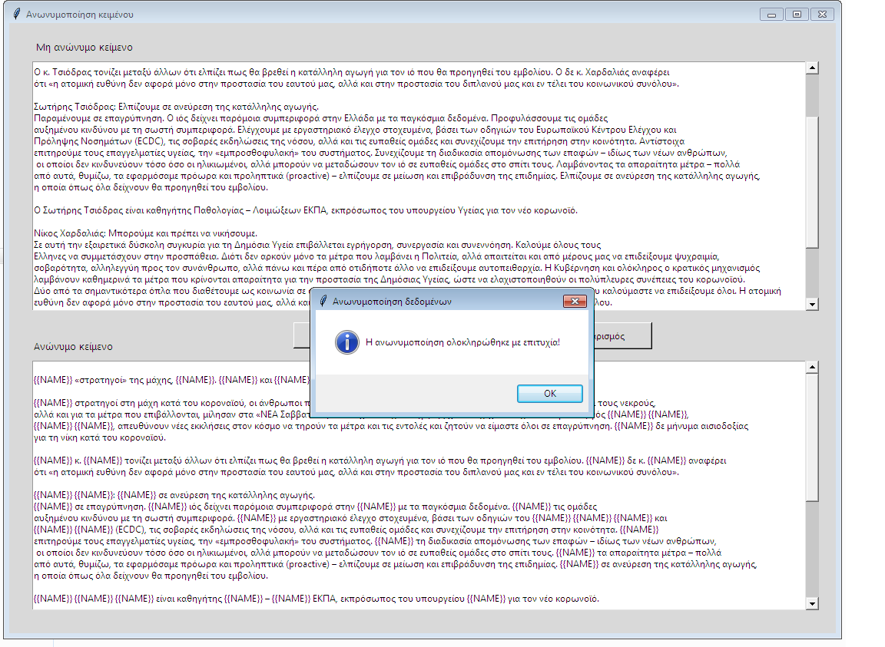
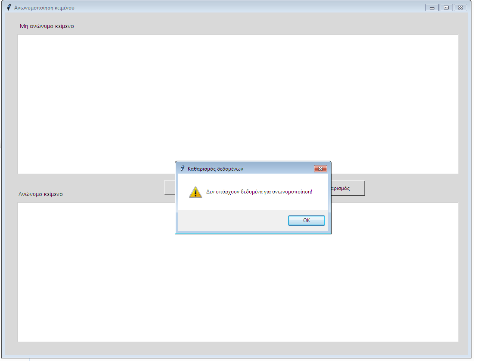

										Anonymization of text
										
A Tcl/Tkinter python app where the user is able to get anonymized text via GDPR standards by simply entering the non-anonymized text. For its better functionality, relevant informational messages are provided.

This app has been made via [python 3.x](https://www.activestate.com/products/python/downloads/), [Tcl 8.6.x](https://www.activestate.com/products/tcl/downloads/) for GUI and [Pycharm IDE](https://www.jetbrains.com/pycharm/download/#section=windows) for its python virtual environment.

**Main view**

**Check view**

